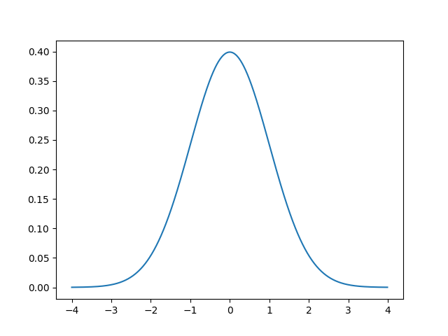

# Data-Distributions

**Probability Density function**
Probability of observing a given value.

| # | Title | Description | Reference |
|---| ----- | ----------- | --------- |
|1| [Gaussian distribution](./gaussian-distribution.py)|    | [reference](https://machinelearningmastery.com/statistical-data-distributions/)|
